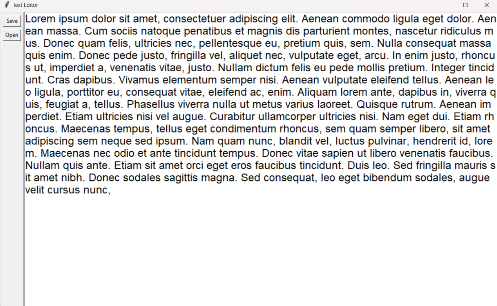

# Simple Text Editor with Tkinter

A basic text editor built using Tkinter in Python. Allows users to create, open, and save text files with a clean and simple user interface.

## Features

- **Create**: Start a new text document.
- **Open**: Load an existing text file into the editor.
- **Save**: Save the content of the editor to a text file.
- **Keyboard Shortcuts**: Use keyboard shortcuts (`Ctrl + S` to save, `Ctrl + O` to open) for quick actions.

## Screenshots



## Getting Started

### Prerequisites

- Python 3.x
- Tkinter library

### Installation

1. Clone the repository:

    ```bash
    git clone https://github.com/your-username/text-editor-tkinter.git
    ```

2. Navigate to the project directory:

    ```bash
    cd text-editor-tkinter
    ```

3. Run the text editor:

    ```bash
    python main.py
    ```

## Usage

- Launch the application using the command mentioned above.
- Use the "Save" button or `Ctrl + S` to save the current content to a text file.
- Use the "Open" button or `Ctrl + O` to load an existing text file into the editor.
- Create, edit, and save your text documents easily!

## Contributing

Contributions are welcome! Please follow these steps:

1. Fork the project.
2. Create a new branch (`git checkout -b feature/awesome-feature`).
3. Commit your changes (`git commit -m 'Add awesome feature'`).
4. Push to the branch (`git push origin feature/awesome-feature`).
5. Open a pull request.

## License

This project is licensed under the MIT License - see the [LICENSE](LICENSE) file for details.

## Acknowledgments

- [Tkinter Documentation](https://docs.python.org/3/library/tkinter.html)
